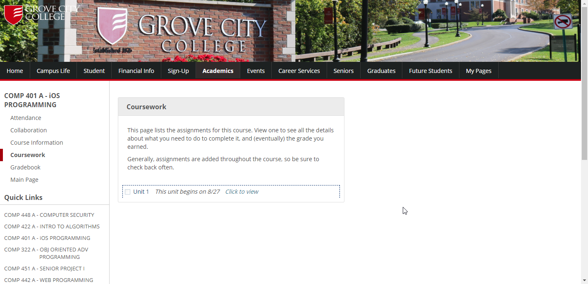

**NOW UPDATED FOR THE 2018 REDESIGN :+1:** 

Ever wanted MyGCC to look *non*-awful?

I'm open to feedback for improvments, this was just a quick hack one night.
This all started as a quick script to keep me logged-in (which it does pretty well).

# Using MyGCC-Plus
 1. Install the TamperMokey plugin for google chrome (or GreeseMonkey for Firefox)
 2. Add mygcc-plus.js as a new user script....
 3. Save

# Customizing
  1. Settings are at the bottom of the page, in the footer of mygcc

# Features
  1. Courses is always expanded
  2. Auto logs you in
  3. Keeps you logged in (usually)
  4. Looks better (OPTIONAL)
  5. Courses links go to Coursework page (OPTIONAL)
