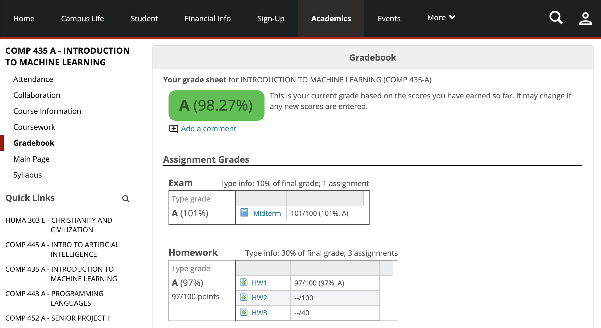

# Install
  1. Install the TamperMokey plugin for google chrome (or GreeseMonkey for Firefox)
  2. Navigate to: [https://github.com/JakeThurman/mygcc-plus/raw/master/mygcc-plus.user.js](https://github.com/JakeThurman/mygcc-plus/raw/master/mygcc-plus.user.js)

## Features
  1. Courses is always expanded
  2. Auto logs you in
  3. Keeps you logged in (usually)
  4. Looks better (OPTIONAL)
  5. Courses links go to Coursework page (OPTIONAL)

Settings are at the bottom of the page, in the footer of mygcc.

The plugin will automatically check for updates. You can turn this off in tamper monkey settings.

## Maintainers
This repo has been maintained by the following:

- @JakeThurman ('19)
- @IanSpryn ('20)

Thanks to the following people for contributing (directly or indirectly) to this repo

- @davidcorbin ('20) [Borrowed login code, name from his [mygcc-plus chrome plugin](https://github.com/davidcorbin/mygcc-plus)]
- @lukemeierj ('19)
- @noahtallen ('19)

## Before
Just for reference, here's mygcc without the plugin:

